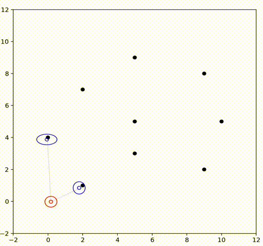

# Simultaneous Localization and Mapping (SLAM) Course Solutions

This repository contains my solutions to the exercises of the SLAM course at the University of Freiburg. 
The course is taught by Prof. Dr. Cyrill Stachniss. 
The course is available on [YouTube](https://www.youtube.com/watch?v=U6vr3iNrwRA&list=PLgnQpQtFTOGQrZ4O5QzbIHgl3b1JHimN_), 
and the coursework can be found on the [Course Homepage](http://ais.informatik.uni-freiburg.de/teaching/ws13/mapping/index_en.php).

Originally the code examples were written in Octave so I rewrote them in Python and added the solutions to the exercises.

# Algorithm Examples

## Extended Kalman Filter (EKF) SLAM
Derivation of the state and observation models for the EKF SLAM algorithm can be found in [this notebook](./EKF_derivations.ipynb)

